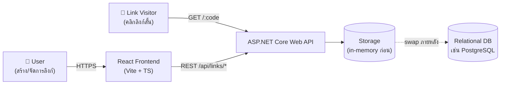
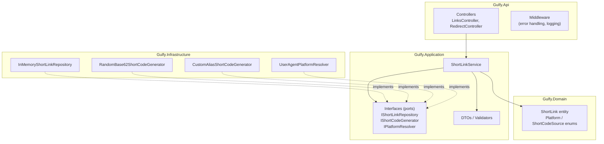
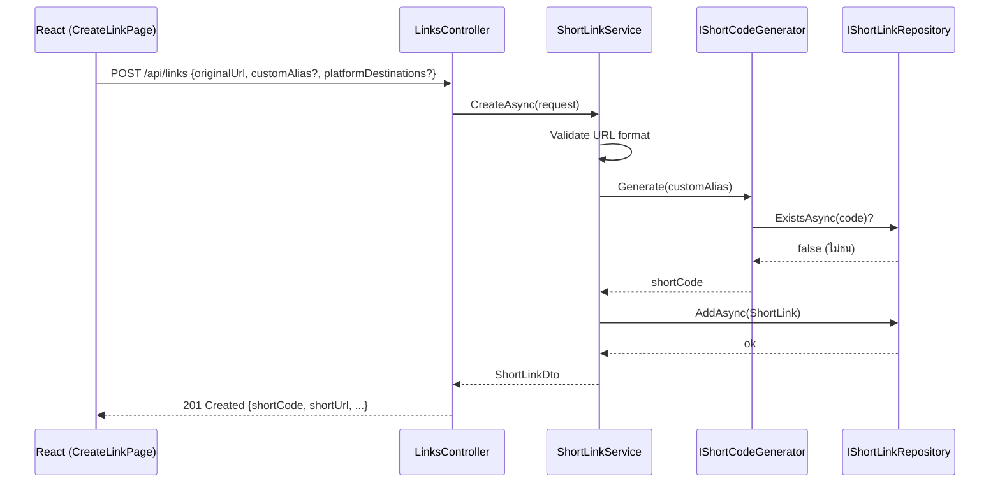
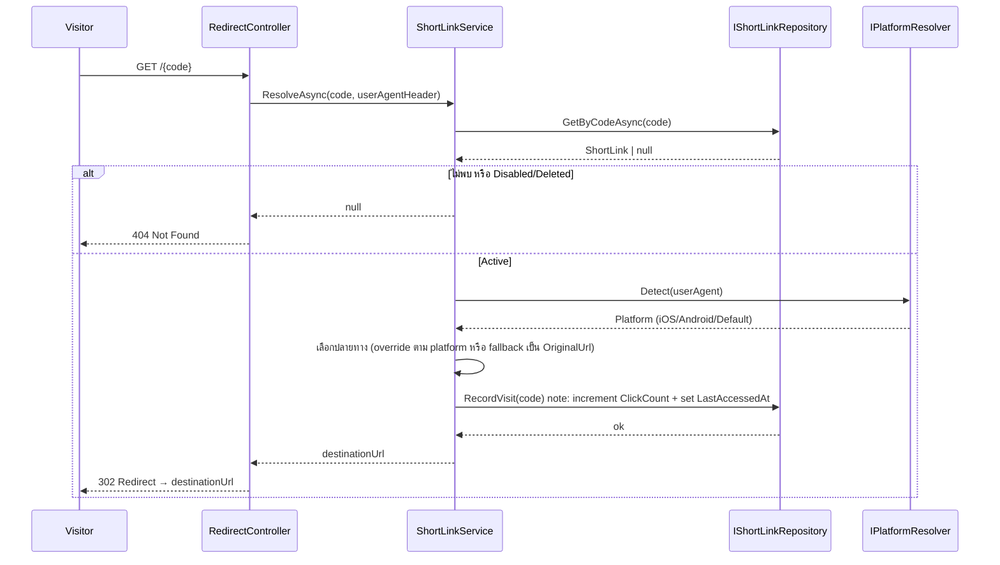
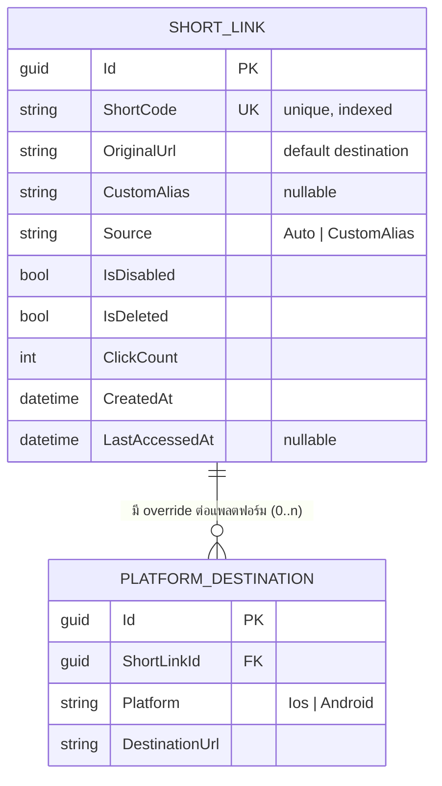
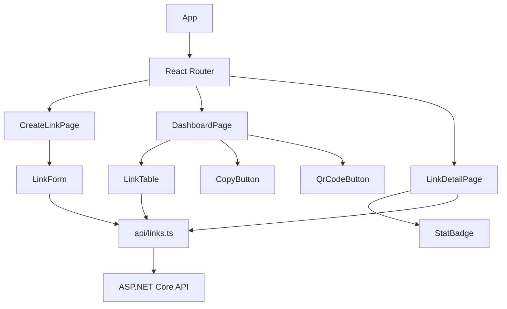
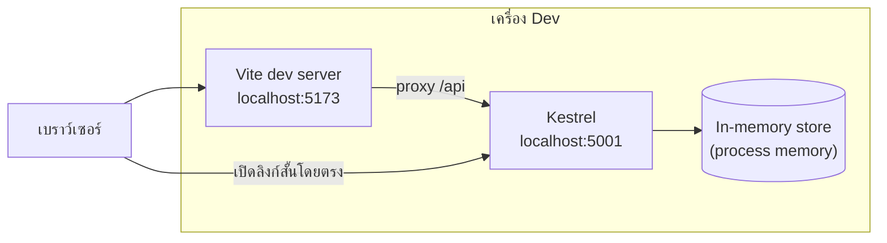

# Architecture — URL Link Shortener

> เอกสารนี้รวมแผนภาพสถาปัตยกรรม (architecture diagrams) และ ER design เบื้องต้นของระบบ ก่อนเริ่ม implement จริง เพื่อใช้เป็นจุดอ้างอิงตอนเขียนโค้ดและตอนอธิบายในรอบสัมภาษณ์ ดูสรุปโจทย์และเหตุผลการออกแบบฉบับเต็มได้ที่ `/ai-logs/DESIGN.md`

---

## 1. System Context Diagram

---

## 2. Backend — Layered Architecture

หลักการ: Domain ไม่ผูกกับ framework ใดๆ, Application เห็นแค่ interface (ports), Infrastructure เป็นคนเดียวที่รู้จัก implementation จริง → สลับ storage/strategy ได้โดยไม่แก้ business logic (Dependency Inversion)

---

## 3. Sequence — สร้างลิงก์สั้น (Create Short Link)

---

## 4. Sequence — Redirect เมื่อมีคนเปิดลิงก์สั้น

---

## 5. ER Diagram — เบื้องต้น (ออกแบบให้ map เข้ากับ relational DB ได้ในอนาคต)

**หมายเหตุการออกแบบ:**
- ช่วง in-memory: เก็บ `PlatformDestinations` เป็น `Dictionary<Platform,string>` ภายใน entity เดียวได้เลย ไม่ต้องมีตารางแยกจริง
- ER ด้านบนกันไว้ล่วงหน้าแบบ normalized (1 ShortLink → many PlatformDestination) เผื่อย้ายไป EF Core/DB จริง จะได้ไม่ต้อง redesign schema
- `ShortCode` ควรมี unique index เสมอ (กันชนกันตอน concurrent create)
- `ClickCount` increment ต้อง atomic — ระวัง race condition เวลามีหลาย request redirect พร้อมกัน

---

## 6. Frontend — Component Architecture

---

## 7. Local Dev Topology

- Backend: Kestrel บน `localhost:5001` (หรือ map `gul.fy` ผ่าน hosts file ถ้าอยากโชว์ short-domain จริง — ไม่บังคับ)
- Frontend: Vite dev server บน `localhost:5173` proxy request `/api/*` ไปที่ backend
- Storage เป็น in-process memory → ข้อจำกัด: ข้อมูลหายเมื่อ restart process, ใช้ได้กับ instance เดียว (ไม่ scale แนวนอนได้จนกว่าจะสลับเป็น DB จริง) — บันทึกไว้เป็น known limitation ใน README

---

## 8. ทางเลือก/trade-off ที่ควรพูดถึงตอนสัมภาษณ์

| หัวข้อ | ทางเลือกที่เลือก | ทางเลือกอื่น | เหตุผล |
|---|---|---|---|
| Storage | In-memory (ConcurrentDictionary) | LiteDB / SQLite | โจทย์อนุญาต in-memory, เน้นความเร็วในการพัฒนา + โชว์ seam สำหรับสลับ DB |
| Short-code gen | Strategy pattern (interface + 2 impl) | if/else เดียวในฟังก์ชัน | ตอบโจทย์ pluggable ตรงๆ และ Open/Closed |
| Platform detect | Server-side, ตอน redirect (จาก User-Agent header) | Client-side JS แล้วส่ง platform มาเป็น query param | โจทย์ระบุ "ตัดสินใจตอน redirect" — ทำที่ server ให้ trust ได้มากกว่าและไม่ต้องพึ่ง JS ฝั่ง client |
| Click counting | Increment แบบ atomic ใน repository (thread-safe) | Fire-and-forget async logging queue | scope เล็ก ไม่จำเป็นต้องมี queue/message broker สำหรับ assignment นี้ |
