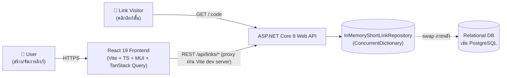
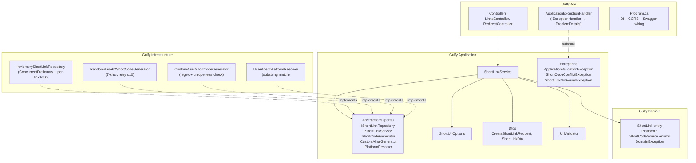
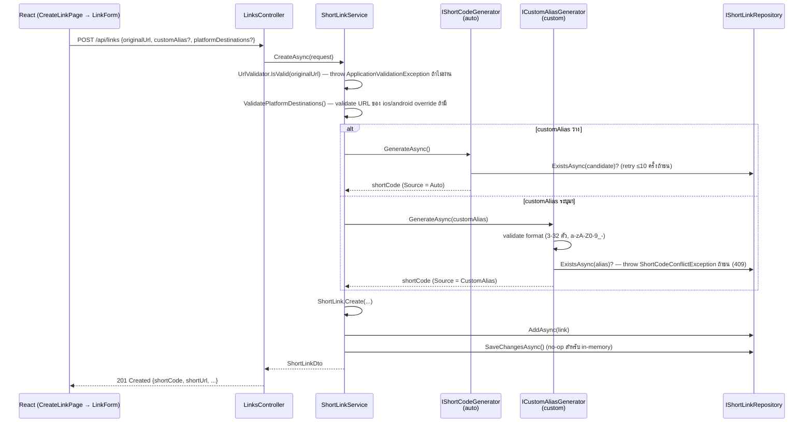
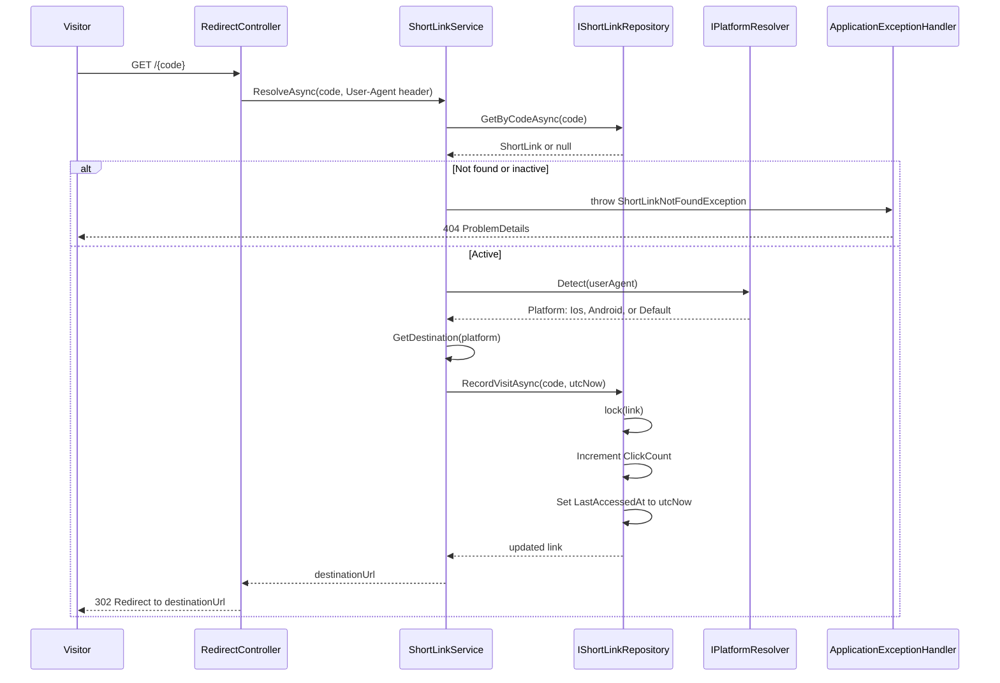
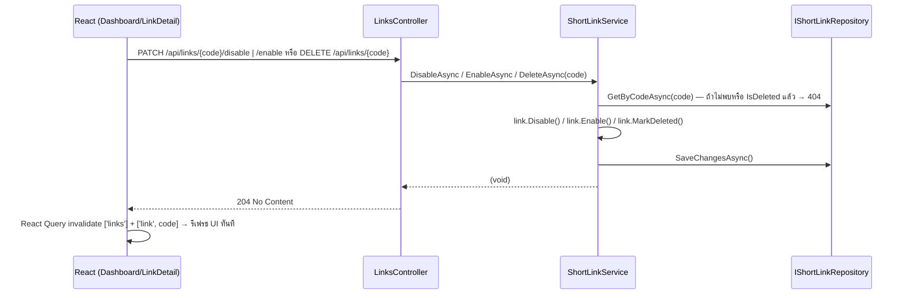
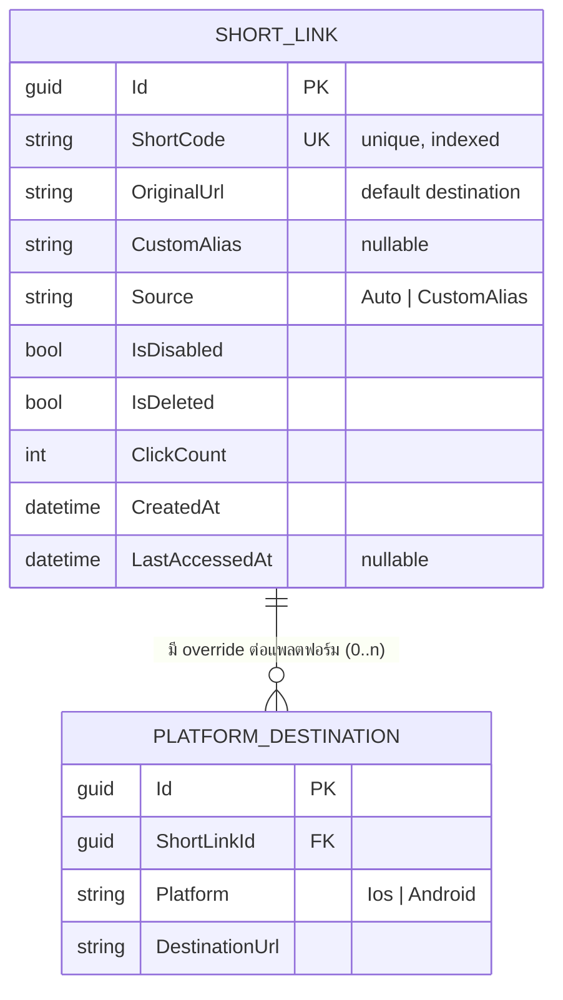
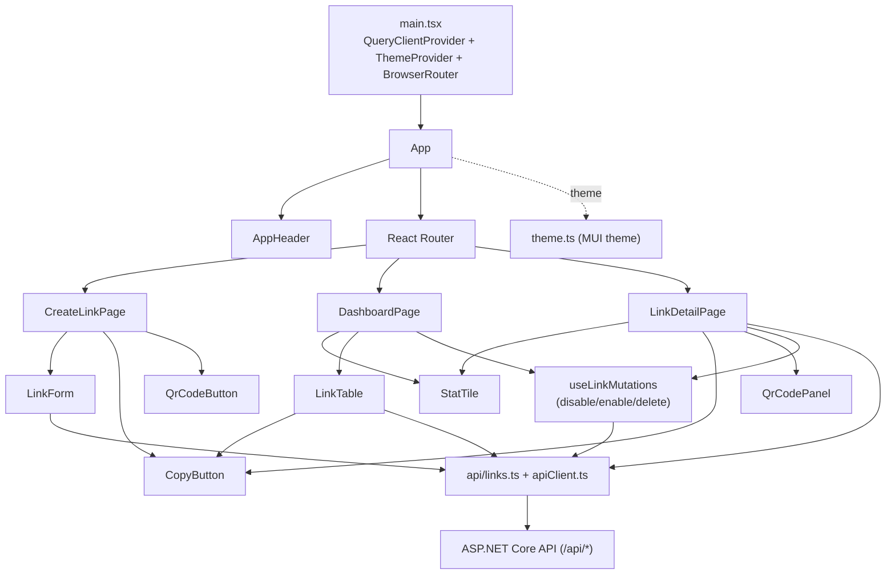
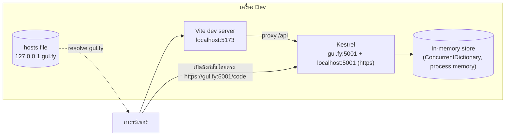

# Architecture — URL Link Shortener (อัปเดตตาม source code ปัจจุบัน)

> เอกสารนี้คือ `ARCHITECTURE.md` เวอร์ชันที่วาดใหม่จาก **source code จริง** ใน `D:\boss\gulf\url-link-shortener` (ตรวจสอบล่าสุด 2026-08-19 — รวมงาน post-launch polish ใน `TASKS.md` section E: MUI migration, gul.fy local domain mapping) เทียบกับฉบับดีไซน์ก่อน implement ที่ `/ai-logs/ARCHITECTURE.md` (ต้นฉบับยังอยู่ ไม่ได้ถูกลบ) ดูสรุปโจทย์ที่ `/ai-logs/DESIGN.md` และรายละเอียด feature-by-feature ที่ `/ai-logs/output/FEATURE_COMPILATION.md`

---

## 1. System Context Diagram

ไม่เปลี่ยนจากดีไซน์เดิมในระดับภาพรวม — สิ่งที่ต่างคือรายละเอียด stack ฝั่ง frontend (เพิ่ม MUI + TanStack Query เข้ามาจริง) และ backend เป็น .NET 8 (ยืนยันเวอร์ชันจริงจาก `.csproj`)

---

## 2. Backend — Layered Architecture

หลักการยังตรงตามดีไซน์เดิม: Domain ไม่มี dependency ภายนอก, Application เห็นแค่ interface, Infrastructure เป็นเจ้าเดียวที่รู้ implementation จริง → สลับ storage/strategy ได้โดยไม่แตะ business logic

**สิ่งที่ต่างจากไดอะแกรมเดิม:** เดิมมี `IShortCodeGenerator` ตัวเดียวรับ `customAlias` เป็น parameter; ของจริงแยกเป็น **สองอินเทอร์เฟซ** คือ `IShortCodeGenerator` (auto, ไม่รับ input) กับ `ICustomAliasGenerator` (รับ alias, validate format + เช็คซ้ำ) — ดูหัวข้อ 8 ด้านล่าง

---

## 3. Sequence — สร้างลิงก์สั้น (Create Short Link)

---

## 4. Sequence — Redirect เมื่อมีคนเปิดลิงก์สั้น

**สิ่งที่ต่างจากไดอะแกรมเดิม:** ดีไซน์เดิมวาดเป็น "return null → 404" ตรงๆ; ของจริงใช้ exception (`ShortLinkNotFoundException`) โยนออกมาแล้วให้ `ApplicationExceptionHandler` กลาง (ASP.NET Core `IExceptionHandler`) แปลงเป็น 404 ProblemDetails ให้ทุก controller ใช้ path เดียวกัน — behavior เหมือนเดิมทุกประการ ต่างแค่กลไกภายใน

---

## 5. Sequence — Disable / Enable / Delete (ใหม่ — ไม่มีในดีไซน์เดิม)

`Enable` เป็น endpoint ที่เพิ่มเข้ามาเองระหว่าง implement — ดีไซน์เดิมพูดถึงแค่ disable/delete (ดูหัวข้อ 8)

---

## 6. ER Diagram — ตรงกับดีไซน์เดิมทุกประการ

ของจริง (`Gulfy.Domain/ShortLink.cs`) เก็บ `PlatformDestinations` เป็น `Dictionary<Platform,string>` ภายใน entity เดียว ตรงตามที่ดีไซน์เดิมระบุไว้แล้วว่า "ช่วง in-memory ไม่ต้องมีตารางแยกจริง" — ER แบบ normalized ด้านบนยังใช้เป็นเป้าหมายตอนย้ายไป DB จริงได้เหมือนเดิม ไม่มีอะไรเปลี่ยน

---

## 7. Frontend — Component Architecture

**สิ่งที่ต่างจากไดอะแกรมเดิม:**
- Component library เปลี่ยนจาก "plain CSS + design tokens" (ตามที่บันทึกไว้ตอน scaffold, การ์ด FE-01) มาเป็น **MUI (Material UI) v9 + Emotion** พร้อม `theme.ts` กลาง — ไดอะแกรมเดิมไม่มี node นี้เลย
- `StatBadge` ในดีไซน์เดิม → ของจริงชื่อ `StatTile` และถูกใช้ทั้งใน Dashboard และ LinkDetail (ดีไซน์เดิมผูกไว้กับ LinkDetailPage อย่างเดียว)
- Component ที่เพิ่มเข้ามาโดยไม่มีในไดอะแกรมเดิม: `AppHeader` (navigation), `QrCodePanel` (แผง QR ถาวรพร้อมดาวน์โหลด PNG ในหน้า detail — แยกจาก `QrCodeButton` ที่เป็น popover เร็วๆ ในหน้า create-link), `hooks/useLinkMutations.ts` (รวม disable/enable/delete mutation ไว้ที่เดียว ใช้ร่วมกันระหว่าง Dashboard กับ LinkDetail)
- `QrCodeButton` เดิมเคยอยู่ในแถวของ `LinkTable` ด้วย แต่ถูกเอาออกภายหลัง (ดู `TASKS.md` post-launch polish) เพราะ actions column ในตารางเริ่มแน่นเกินไป — ตอนนี้ใช้เฉพาะใน `CreateLinkPage` (ผลลัพธ์หลังสร้างลิงก์) เท่านั้น ส่วนหน้า detail ใช้ `QrCodePanel` (ถาวร มี download) แทน
- Data fetching ใช้ TanStack Query (React Query) ตรงตามที่ดีไซน์เดิมเสนอไว้เป็นตัวเลือก — ไม่ใช้ SWR

---

## 8. Local Dev Topology

- Backend: Kestrel bind สอง URL พร้อมกันผ่าน launch profile `https` (`launchSettings.json`): `https://gul.fy:5001` และ `https://localhost:5001` — `appsettings.json` → `ShortUrl:BaseUrl` = `https://gul.fy:5001` ทำให้ `shortUrl` ที่ API สร้างออกมาชี้ไปโดเมนนี้เสมอ (เปลี่ยนจากดีไซน์เดิม/เวอร์ชันก่อนหน้าที่ใช้ `http://localhost:5001` ตรงๆ)
  - `gul.fy` **ไม่ใช่โดเมนจริง** ต้อง map เองผ่าน hosts file (`127.0.0.1 gul.fy`, ต้องใช้สิทธิ์ Administrator) — ไม่ทำก็รันได้ปกติ แค่สลับ `BaseUrl`/launch profile กลับไปใช้ `localhost` แทน (มีขั้นตอนละเอียดใน `README.md` และ `backend/README.md` หัวข้อ "Local domain mapping")
  - Dev cert เริ่มต้นของ ASP.NET Core มี CN เป็น `localhost` ไม่ใช่ `gul.fy` เบราว์เซอร์จะเตือน cert mismatch เวลาเปิดลิงก์ผ่าน `gul.fy` — เป็นพฤติกรรมที่รู้อยู่แล้ว ไม่ใช่บั๊ก (แก้ให้หายเตือนได้ด้วย `mkcert`)
  - **ขั้นตอนนี้ไม่บังคับสำหรับการรัน/ตรวจงาน** — ทุกฟีเจอร์ทำงานเหมือนกันทุกประการผ่าน `http://localhost:5001` ธรรมดา
- Frontend: Vite dev server บน `localhost:5173` (ไม่ได้ map เข้ากับ `gul.fy` — เคยทดลองแล้ว revert กลับ), CORS เปิดให้ origin นี้เท่านั้น (`Cors:AllowedOrigins` ใน `appsettings.json`)
- Swagger UI เปิดที่ `/swagger` เมื่อรันแบบ Development (ตามที่ดีไซน์เดิมวางแผนไว้เป็น bonus ใน task BE-12 — ทำจริงแล้ว)
- Storage เป็น in-process memory เหมือนดีไซน์เดิมทุกประการ — ข้อจำกัดเดียวกัน (ข้อมูลหายเมื่อ restart, ใช้ได้ instance เดียว)

---

## 9. สรุปการเปลี่ยนแปลงจากดีไซน์เดิม (Delta จากไฟล์ `ai-logs/ARCHITECTURE.md` ฉบับก่อน implement)

| จุด | ดีไซน์เดิมว่าไว้ | ของจริงเป็นยังไง | ผลกระทบ |
|---|---|---|---|
| Short-code generation interface | `IShortCodeGenerator` ตัวเดียว รับ `Generate(string? requestedAlias)` | แยกเป็น `IShortCodeGenerator` (auto, ไม่รับ input) กับ `ICustomAliasGenerator` (รับ alias) คนละ contract | เป็นการ refine ให้ตรง single-responsibility มากขึ้น (auto กับ custom มี error-handling ต่างกัน: auto retry เงียบๆ, custom throw conflict ตรงๆ) — ไม่กระทบ behavior ที่ผู้ใช้เห็น |
| Frontend styling | Plain CSS + design tokens (ตาม UI mockup ที่ทำไว้ก่อน) | MUI (Material UI) v9 + Emotion + `theme.ts` | Bundle ใหญ่ขึ้น แลกกับ component ที่ครบ/accessible และพัฒนาไว กว่าเดิมมาก |
| Error handling ตอน redirect | ไดอะแกรมวาดเป็น "return null → 404" ตรงๆ | ใช้ exception (`ShortLinkNotFoundException`) + `ApplicationExceptionHandler` กลาง (`IExceptionHandler`) | Behavior เดิมทุกประการ ต่างแค่กลไกภายในให้ทุก error path (400/404/409) ไปทางเดียวกัน |
| API endpoints | มีแค่ create/list/get/disable/delete/redirect | เพิ่ม `PATCH /api/links/{code}/enable` | ฟีเจอร์เกินสเปกที่ทำให้ปิดแล้วเปิดกลับได้ ไม่ต้องสร้างลิงก์ใหม่ |
| Component diagram (frontend) | `StatBadge`, ไม่มี `AppHeader`/`QrCodePanel`/hooks แยก | `StatTile`, มี `AppHeader`, `QrCodePanel` (แยกจาก `QrCodeButton`), `useLinkMutations` hook รวม mutation | UI ครบและ maintain ง่ายขึ้นกว่าที่ร่างไว้ตอนแรก |
| Base URL / local dev domain | ใช้ `localhost:PORT` ตรงๆ ตามที่โจทย์อนุญาต ไม่บังคับ map โดเมนจริง | `ShortUrl:BaseUrl` = `https://gul.fy:5001` (post-launch polish, `TASKS.md` BE-13/DOC-08) ต้อง map `gul.fy → 127.0.0.1` ผ่าน hosts file เอง ถึงจะเปิดลิงก์ที่สร้างได้จริง | Cosmetic ล้วนๆ ให้ตรงกับ UI mockup — ไม่บังคับต่อการรัน/ตรวจงาน, สลับกลับ `localhost` ได้ทุกเมื่อ (ดู §8) |
| ทุกจุดอื่น (system context, backend layering, ER shape, thread-safety ของ click counting) | — | ตรงกับดีไซน์เดิมทุกประการ | ไม่มีการเปลี่ยนแปลง |
